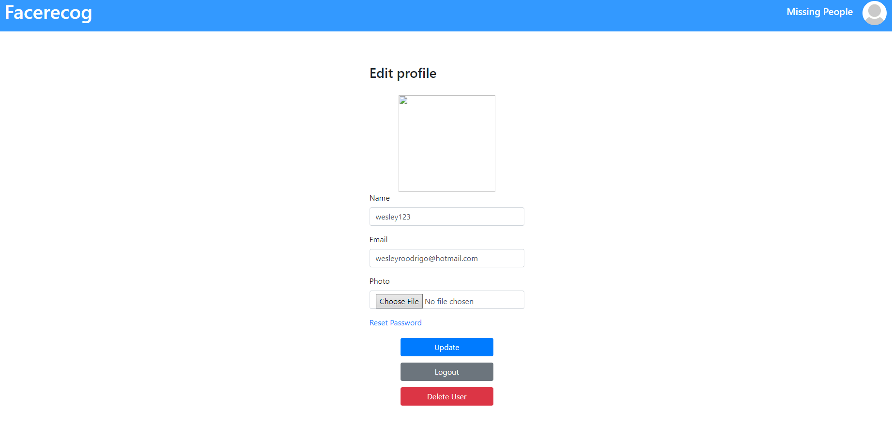

# Facerecog
###Projeto I da matéria de Programação para Web

-> Documentação com o objetivo de explicar o projeto e suas funcionalidades;

O projeto consiste em criar um database com pessoas desaparecidas para
que seja possivel identifica-lás através de uma câmera de segurança

Em sua fase inicial, o objetivo deste projeto é ler os dados das pessoas
do banco de dados Postgres no Heroku e através da biblioteca face-recognition
identificar as pessoas.

+ O usuário faz o cadastro contendo as seguintes informações:
    - id no banco de dados como PK;
    - nome do usuario (name, varchar, 50)
    - email do usuario para login(email, varchar, 50)
    - senha para login(password_hash **pois a senha é encriptada** varchar, 100)

Após o usuario fazer o cadastro, e com todas as informações validadas de acordo com
as requsições de cadastro, o mesmo é redirecionado para a pagina de reconhecimento facial,
aonde é realizada o reconhecimento facial da pessoa na qual está cadastrada no banco de dados.

Na mesma página, na parte do header da página, existem as seguintes opcões:

+ No canto superior direito, no nome da aplicação, ao clicar no mesmo, o usuário
retorna para a pagina inicial;
+ Em <code>Missing People </code>, ao clicar na opção, o usuário é redirecionado
para a seguinte página contendo uma lista com as pessoas desaparecidas:

+ Na mesma página de <code> Missing People </code>, o usuário pode editar uma pessoa
desaparecida, ver as suas informações e também adicionar uma pessoa desaparecida,
clicando em  no canto inferior direito da tela, levando
para a seguinte página:

+ na tela de adicionar uma pessoa desaparecida, o usuário precisa entrar com as seguintes
informações:
    - Nome (name, varchar50)
    - Data de Nascimento ( birthday, timestamp withou time zone)
    - Lugar de Nascimento (birthplace, varchar 50)
    - Lugar de desaparecimento (place_of_disappearance, varchar 100)
    - detalhes do desaparecimento(disappearance_details, text)
    - Photo da pessoa desaparecida(referente a tabela images,
    - sendo guardada no banco como <code>[binary data] bytea</code>)

+ No canto superior direito, no ícone do usuário, é possivel alterar as 
informações do usuário, fazer logout da conta e deletar a conta do usuário,
como mostrado na imagem a seguir:

+ É possivel também alterar a senha do usuário, clicando em Reset Passowrd;
